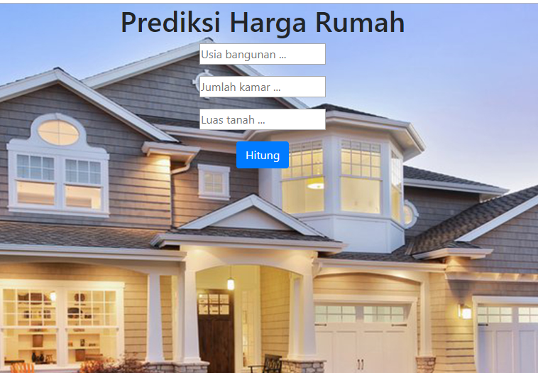
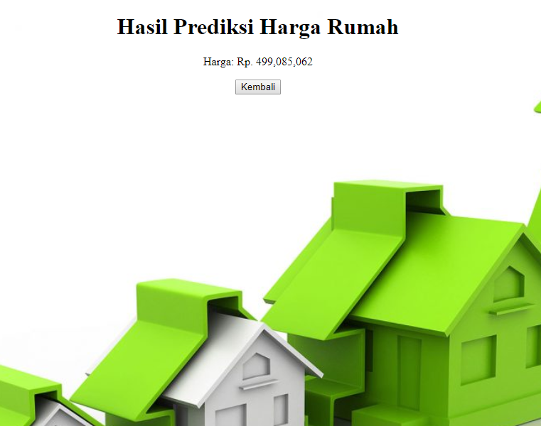
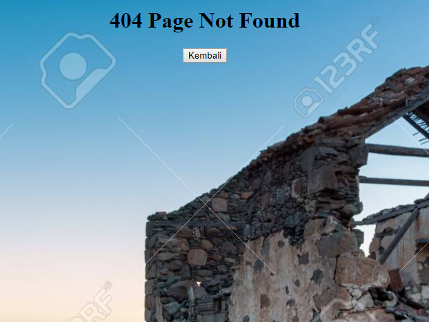

# Aplikasi Flask Sederhana untuk Memprediksi Harga Rumah

Repo ini berisi file [app.py](app.py) yang merupakan sebuah aplikasi flask sederhana. Di dalam webapp tersebut terdapat model machine learning yang dapat memprediksi harga rumah berdasarkan jumlah kamar, usia bangunan (dalam tahun), dan luas tanah (km2). 

Berikut tampilan dari website tersebut:

Semoga bermanfaat! 🏡🏡